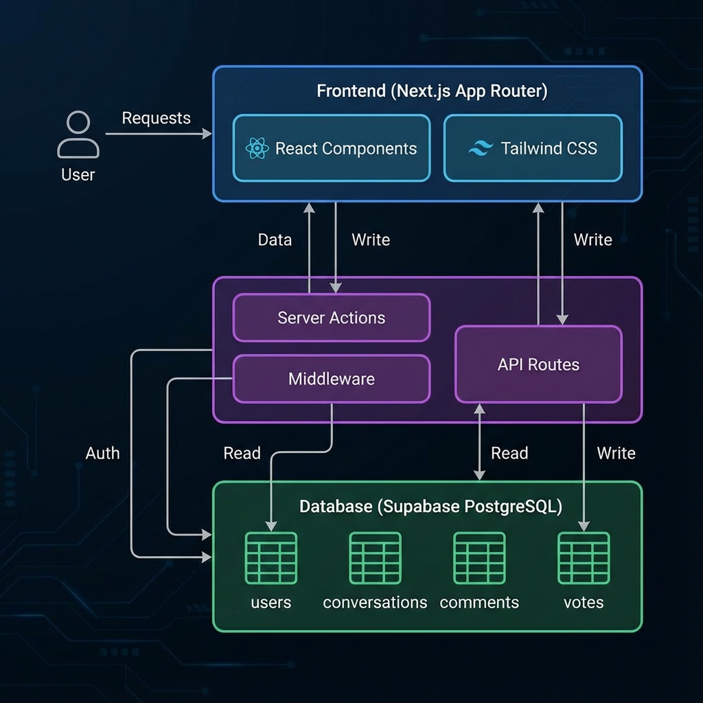
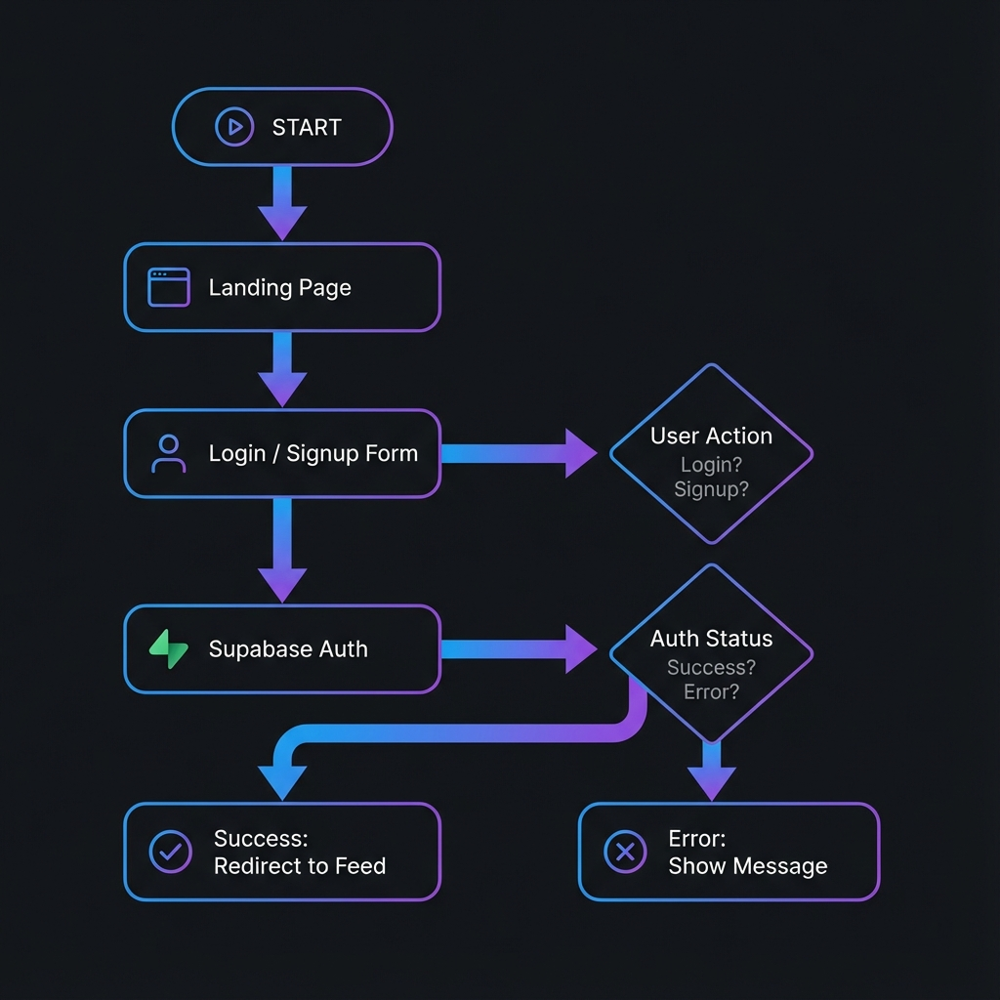
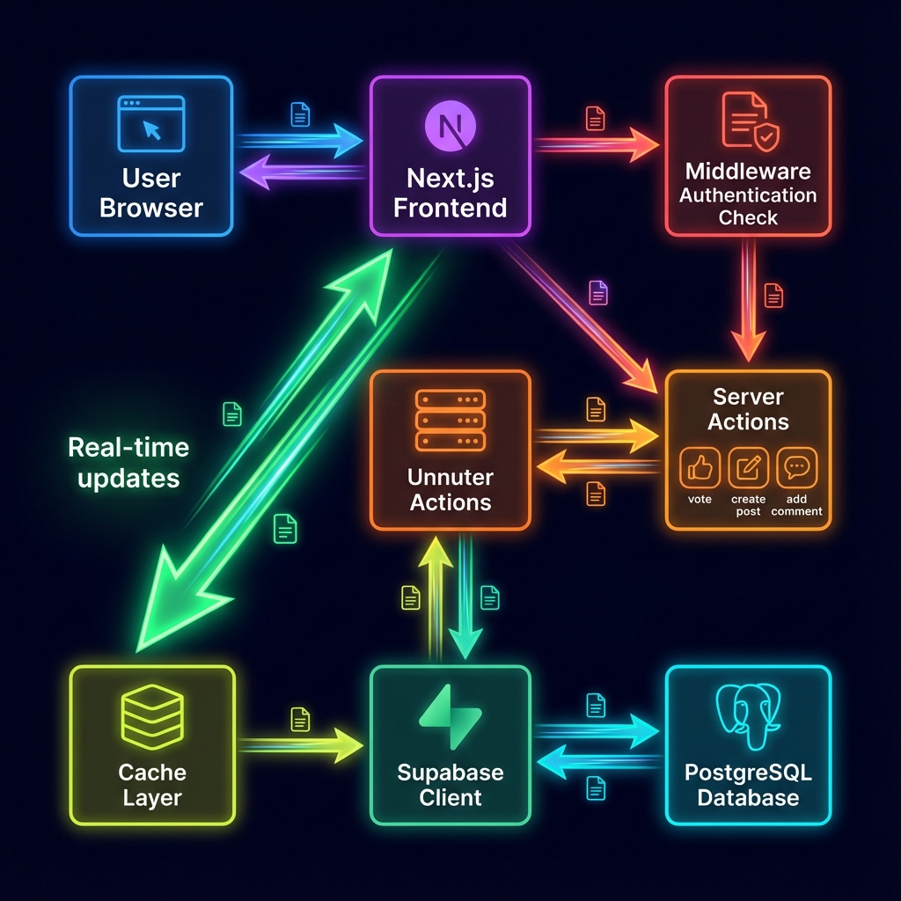
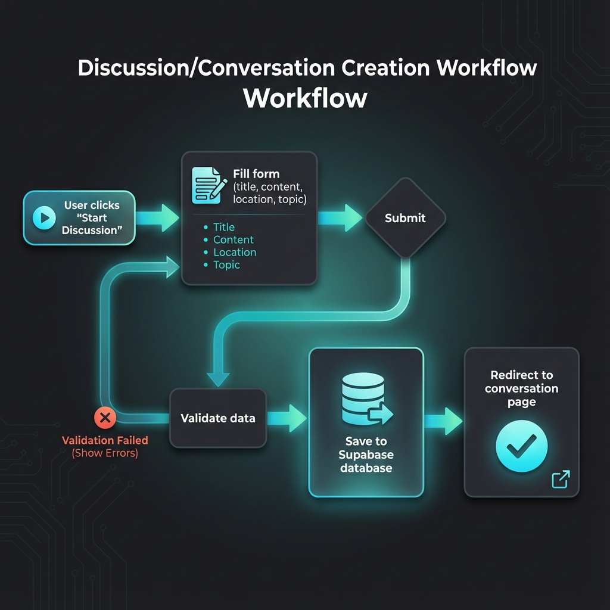
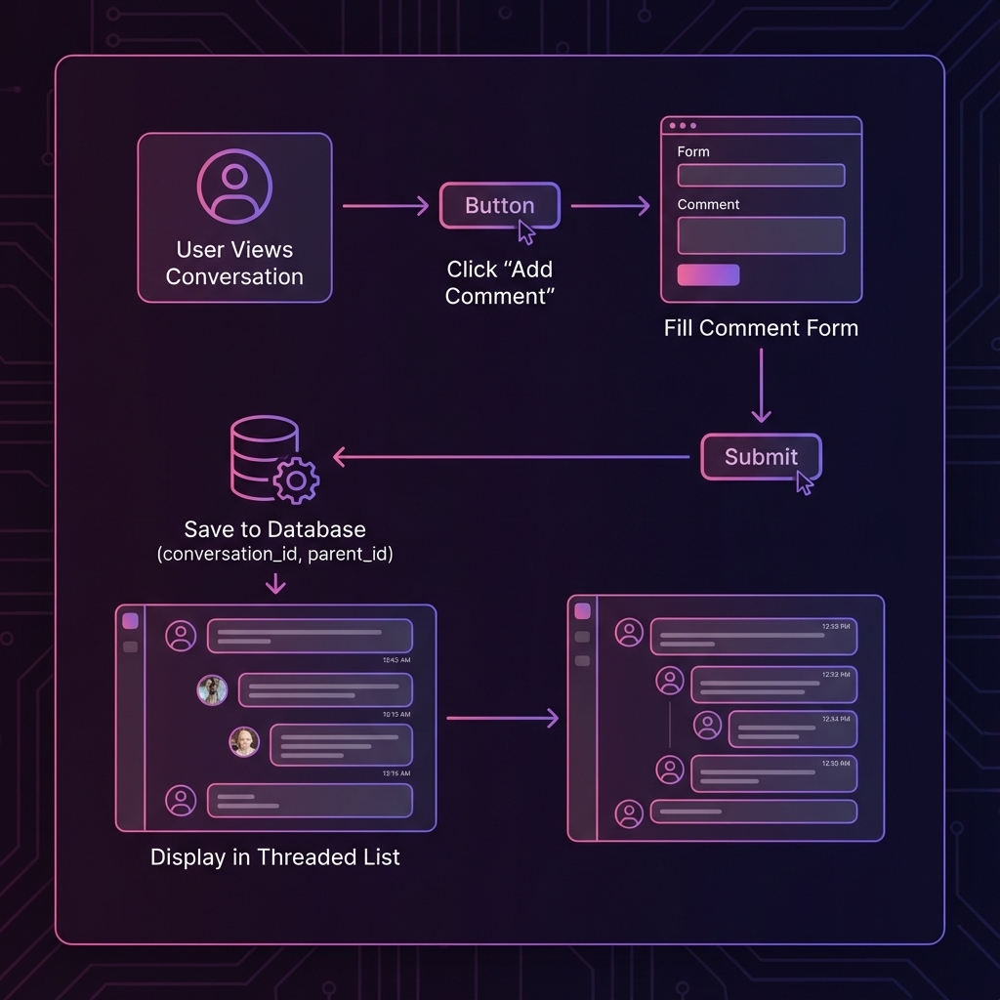
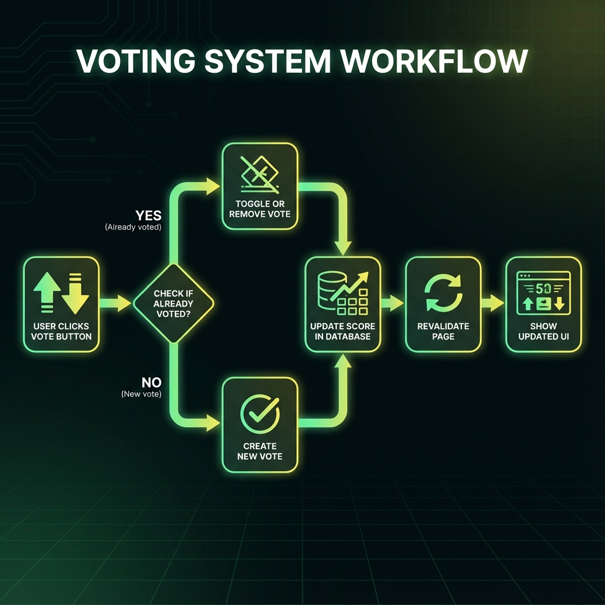
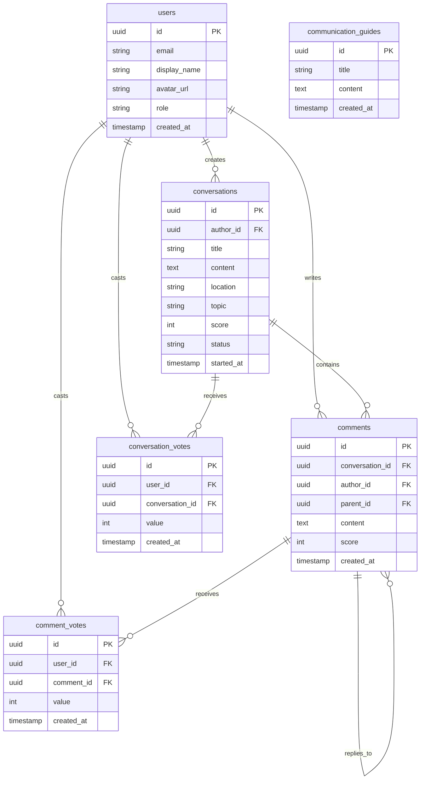

# Dialogues @ Beloit - Application Workflow Documentation

> **Last Updated**: November 25, 2024  
> **Version**: 1.0  
> **Application**: Anonymous Discussion Platform for Beloit College

---

## 📋 Table of Contents

1. [System Architecture](#system-architecture)
2. [Authentication Flow](#authentication-flow)
3. [Main Application Workflows](#main-application-workflows)
4. [Database Schema & Relationships](#database-schema--relationships)
5. [Component Hierarchy](#component-hierarchy)
6. [Security & Middleware](#security--middleware)

---

## 🏗️ System Architecture

The application follows a modern full-stack architecture using Next.js 14 with the App Router pattern, Supabase for backend services, and PostgreSQL for data persistence.



### Technology Stack

| Layer | Technologies |
|-------|-------------|
| **Frontend** | Next.js 14 (App Router), React, TypeScript |
| **Styling** | Tailwind CSS, Lucide Icons |
| **Backend** | Next.js Server Actions, Middleware |
| **Authentication** | Supabase Auth |
| **Database** | PostgreSQL (via Supabase) |
| **Deployment** | Vercel (recommended) |

### Key Architectural Patterns

- **Server-Side Rendering (SSR)**: All pages are server-rendered for optimal performance and SEO
- **Server Actions**: Form submissions and mutations use Next.js Server Actions
- **Row-Level Security (RLS)**: Database security enforced at the PostgreSQL level
- **Optimistic UI Updates**: Client-side voting with server revalidation

---

## 🔐 Authentication Flow

The application uses Supabase Auth for secure user authentication with email/password.



### Authentication Workflow

#### 1. **Initial Access**
- User visits any page
- Middleware intercepts request and validates session
- If no valid session exists, user can browse public content but cannot interact

#### 2. **Login/Signup Process**
Located at `/login` route:

```typescript
// File: app/login/page.tsx
- User fills AuthForm component
- Credentials sent to Supabase Auth
- On success: Session created, user profile created/updated in users table
- Redirect to feed page (/)
```

#### 3. **Session Management**
- Sessions stored in HTTP-only cookies
- Middleware refreshes session on each request
- Automatic token refresh handled by Supabase client

#### 4. **Protected Routes**
Routes requiring authentication:
- `/start` - Create new discussion
- `/conversations/[id]` - View and comment (requires auth to comment)
- `/me` - User profile and post history

---

## 🔄 Main Application Workflows

### Data Flow Overview



---

### 1️⃣ Browse Discussions (Feed Page)

**Route**: `/` (app/page.tsx)

#### Workflow Steps:

1. **Page Load**
   - Server fetches conversations from database
   - Supports sorting: `?sort=top` (by score) or `?sort=new` (by date)
   - Fetches user's votes if authenticated

2. **Data Fetching**
   ```typescript
   // Fetch conversations
   supabase.from('conversations').select('*')
     .order('score' | 'started_at', { ascending: false })
   
   // Fetch user votes (if logged in)
   supabase.from('conversation_votes')
     .select('conversation_id, value')
     .eq('user_id', user.id)
   ```

3. **Rendering**
   - Each conversation rendered as `ConversationCard` component
   - Shows: title, content, author, location, topic, score, timestamp
   - Vote buttons (upvote/downvote) with current user's vote highlighted

4. **User Interactions**
   - Click conversation → Navigate to `/conversations/[id]`
   - Vote on conversation → Trigger vote server action
   - Change sort filter → Reload with new query param

---

### 2️⃣ Create New Discussion

**Route**: `/start` (app/start/page.tsx)



#### Workflow Steps:

1. **Access Control**
   - Check if user is authenticated
   - If not → Show login prompt
   - If yes → Display `StartDiscussionForm`

2. **Form Submission**
   ```typescript
   // File: app/start/StartDiscussionForm.tsx
   Form fields:
   - title (required, max 200 chars)
   - content (required)
   - location (optional, e.g., "Library", "Dorm")
   - topic (optional, e.g., "Academics", "Social")
   ```

3. **Server Action Processing**
   - Validate form data
   - Insert into `conversations` table:
     ```sql
     INSERT INTO conversations (
       title, content, location, topic, 
       author_id, started_at, status, score
     )
     ```
   - Initial score = 0, status = 'open'

4. **Post-Creation**
   - Redirect to new conversation page: `/conversations/[id]`
   - Revalidate feed page to show new post

---

### 3️⃣ View & Comment on Discussion

**Route**: `/conversations/[id]` (app/conversations/[id]/page.tsx)



#### Workflow Steps:

1. **Page Load**
   - Fetch conversation by ID
   - If not found → 404 page
   - Fetch all comments with author info (join with users table)
   - Fetch user's votes for conversation and all comments

2. **Data Structure**
   ```typescript
   // Conversation with nested comments
   {
     conversation: {
       id, title, content, author_id, location, 
       topic, score, status, started_at
     },
     comments: [
       {
         id, content, author_id, parent_id, 
         conversation_id, score, created_at,
         author: { display_name, avatar_url }
       }
     ]
   }
   ```

3. **Comment Rendering**
   - `CommentList` component displays threaded comments
   - Supports nested replies (parent_id relationship)
   - Each comment shows: author, content, score, vote buttons, reply option

4. **Add New Comment**
   - If conversation status = 'open' → Show `NewCommentForm`
   - If status = 'closed' → Show "Discussion closed" message
   - Submit comment → Insert into `comments` table
   - Revalidate page to show new comment

5. **Author Actions**
   - If current user is author → Show "Close Discussion" button
   - Closing sets status = 'closed', prevents new comments
   - Author can also delete conversation (cascades to all comments/votes)

---

### 4️⃣ Voting System

**Server Action**: `vote()` in app/actions.ts



#### Workflow Steps:

1. **User Clicks Vote Button**
   - Component: `VoteButtons.tsx` (used by ConversationCard, CommentVote)
   - Passes: type ('conversation' | 'comment'), id, value (1 or -1)

2. **Check Existing Vote**
   ```typescript
   // Query user's existing vote
   supabase.from('conversation_votes' | 'comment_votes')
     .select('*')
     .eq('user_id', user.id)
     .eq('conversation_id' | 'comment_id', id)
   ```

3. **Vote Logic**
   - **No existing vote**: Create new vote, score += value
   - **Same vote exists**: Remove vote (toggle off), score -= value
   - **Different vote exists**: Update vote, score += (value * 2)
     - Example: User had downvote (-1), clicks upvote (+1)
     - Score change: +2 (remove -1, add +1)

4. **Database Updates**
   ```typescript
   // Update vote record
   INSERT/UPDATE/DELETE in conversation_votes or comment_votes
   
   // Update score
   UPDATE conversations/comments 
   SET score = score + newScoreDelta
   WHERE id = [id]
   ```

5. **UI Revalidation**
   - Revalidate affected paths:
     - `/` (feed page)
     - `/conversations/[id]` (conversation page)
     - `/me` (user profile)
   - Next.js re-renders with updated data

---

### 5️⃣ User Profile & Post History

**Route**: `/me` (app/me/page.tsx)

#### Workflow Steps:

1. **Authentication Check**
   - Require valid session
   - If not logged in → Show login prompt

2. **Data Fetching**
   ```typescript
   // User profile
   supabase.from('users').select('*').eq('id', user.id)
   
   // User's conversations
   supabase.from('conversations').select('*')
     .eq('author_id', user.id)
     .order('started_at', { ascending: false })
   
   // Communication guides (static content)
   supabase.from('communication_guides').select('*')
   ```

3. **Profile Display**
   - Avatar (from avatar_url or first letter of name)
   - Display name
   - Email
   - Role badge (user/moderator/admin)

4. **Post History**
   - List of user's conversations
   - Each rendered as `ConversationCard`
   - Can click to view, vote, or delete own posts

5. **Communication Guides**
   - Display community guidelines
   - Tips for respectful dialogue
   - Stored in `communication_guides` table

6. **Sign Out**
   - `SignOutButton` component
   - Calls `supabase.auth.signOut()`
   - Redirects to login page

---

## 🗄️ Database Schema & Relationships

### Entity Relationship Diagram



### Key Relationships

1. **users → conversations** (1:N)
   - One user can create many conversations
   - `conversations.author_id` references `users.id`

2. **conversations → comments** (1:N)
   - One conversation can have many comments
   - `comments.conversation_id` references `conversations.id`

3. **comments → comments** (1:N, self-referencing)
   - Comments can reply to other comments (threaded)
   - `comments.parent_id` references `comments.id`

4. **users → votes** (1:N)
   - One user can cast many votes
   - Separate tables for conversation_votes and comment_votes

5. **Cascade Deletes**
   - Deleting a conversation deletes all its comments and votes
   - Deleting a comment deletes all its replies and votes
   - Implemented via `migration.sql`

---

## 🧩 Component Hierarchy

### Page Components (Server Components)

```
app/
├── page.tsx                    # Feed page (home)
├── login/page.tsx              # Authentication page
├── start/page.tsx              # Create discussion page
├── conversations/[id]/page.tsx # Individual conversation page
└── me/page.tsx                 # User profile page
```

### Reusable Components (Client Components)

```
components/
├── AuthForm.tsx               # Login/signup form
├── BottomNav.tsx              # Mobile navigation bar
├── ConversationCard.tsx       # Discussion preview card
├── ConversationVote.tsx       # Vote buttons for conversations
├── CommentList.tsx            # Threaded comment display
├── CommentVote.tsx            # Vote buttons for comments
├── NewCommentForm.tsx         # Add comment form
├── VoteButtons.tsx            # Generic vote UI component
├── ParticlesBackground.tsx    # Animated background effect
└── SignOutButton.tsx          # Logout button
```

### Component Data Flow

```
Page (Server Component)
  ↓ Fetch data from Supabase
  ↓ Pass props to client components
Client Components
  ↓ Handle user interactions
  ↓ Call server actions
Server Actions (app/actions.ts)
  ↓ Mutate database
  ↓ Revalidate pages
  ↓ Return to client
```

---

## 🛡️ Security & Middleware

### Middleware Authentication

**File**: `middleware.ts`

```typescript
// Runs on every request
export async function middleware(request: NextRequest) {
  // Create Supabase client with cookie handling
  const supabase = createServerClient(...)
  
  // Validate session (refreshes token if needed)
  await supabase.auth.getUser()
  
  // Continue to requested page
  return response
}
```

**Matcher Configuration**:
- Runs on all routes except static files
- Excludes: `_next/static`, `_next/image`, images, favicon

### Row-Level Security (RLS)

Enforced at database level via Supabase policies:

1. **Read Policies**
   - Anyone can read conversations and comments
   - Only authenticated users can read votes

2. **Write Policies**
   - Only authenticated users can create conversations/comments
   - Users can only vote once per item
   - Users can only delete their own content

3. **Update Policies**
   - Users can only update their own profile
   - Only authors can close their conversations

### Server Action Security

All server actions in `app/actions.ts`:
- Verify user authentication
- Check ownership before mutations
- Validate input data
- Use parameterized queries (SQL injection protection)

---

## 🚀 Deployment Workflow

### Local Development

```bash
# Install dependencies
npm install

# Set up environment variables
# Create .env.local with:
# NEXT_PUBLIC_SUPABASE_URL=your_url
# NEXT_PUBLIC_SUPABASE_ANON_KEY=your_key

# Run database migrations
# Execute schema.sql and migration.sql in Supabase SQL Editor

# Start dev server
npm run dev
```

### Production Deployment (Vercel)

1. **Push to GitHub**
   ```bash
   git add .
   git commit -m "Deploy to production"
   git push origin main
   ```

2. **Vercel Setup**
   - Connect GitHub repository
   - Add environment variables (Supabase credentials)
   - Deploy automatically on push

3. **Database Configuration**
   - Ensure Supabase project is in production mode
   - Update `NEXT_PUBLIC_SUPABASE_URL` to production URL
   - Enable RLS policies

---

## 📊 Performance Optimizations

### Implemented Optimizations

1. **Server-Side Rendering**
   - All pages pre-rendered on server
   - Faster initial page load
   - Better SEO

2. **Incremental Static Regeneration**
   - Use `revalidatePath()` after mutations
   - Cached pages updated on-demand

3. **Optimistic UI Updates**
   - Vote buttons update immediately
   - Server validates in background

4. **Database Indexing**
   - Indexes on foreign keys
   - Indexes on frequently queried columns (author_id, conversation_id)

5. **Lazy Loading**
   - ParticlesBackground only loads on client
   - Images lazy loaded by default

---

## 🔮 Future Enhancements

Potential workflow additions:

- **Real-time Updates**: Use Supabase Realtime for live comment updates
- **Notifications**: Notify users of replies to their posts
- **Search**: Full-text search across conversations
- **Moderation**: Flag inappropriate content, admin dashboard
- **Rich Text**: Markdown support for posts and comments
- **File Uploads**: Attach images to discussions
- **User Mentions**: @mention other users in comments

---

## 📞 Support & Contribution

For questions or contributions:
- Review the [README.md](../README.md)
- Check database schema in schema.sql
- Follow existing code patterns
- Test thoroughly before submitting PRs

---

**Document Version**: 1.0  
**Last Updated**: November 25, 2024  
**Maintained By**: Development Team
